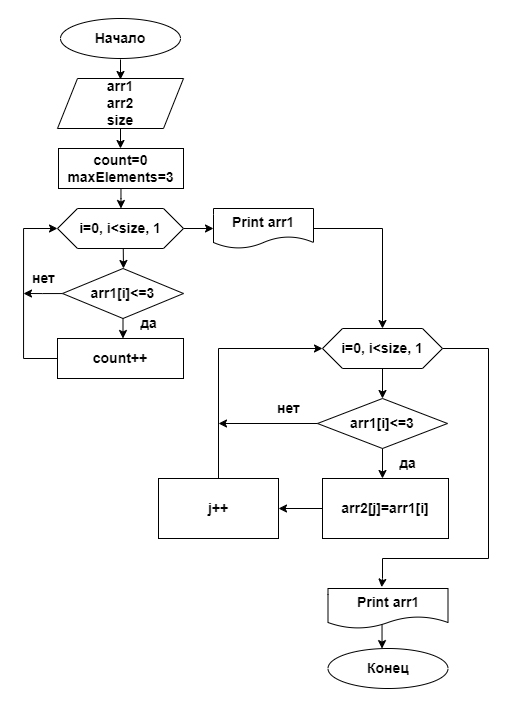

# Control-Work
### **Задача:**

    Написать программу, которая из имеющегося массива строк формирует массив из строк, 
    длина которых меньше либо равна 3 символам. Первоначальный массив можно ввести с клавиатуры, 
    либо задать на старте выполнения алгоритма. При решении не рекомендуется пользоваться коллекциями, 
    лучше обойтись исключительно массивами.

_**Примеры:**_

    ["hello", "2", "world", ":-)"] -> ["2", ":-)"]

    ["1234", "1567", "-2", "computer science"] -> ["-2"]

    ["Russia", "Denmark", "Kazan"] -> []

_**Для выполнения проверочной работы необходимо:**_
1.  Создать репозиторий на GitHub
2.  Нарисовать блок-схему алгоритма (файл Choosing a specialization.png)
3.  Снабдить репозиторий оформленным текстовым описанием решения (файл README.md)
4.  Написать программу, решающую поставленную задачу
5.  Использовать контроль версий в работе над этим небольшим проектом (не должно быть так что все залито одним коммитом, как минимум этапы 2, 3 и 4 должны быть расположены в разных коммитах)

### **Решение:**

1. Вначале пользователю предлагается ввести информацию сколько элементов будет входить в массив **(size)**, а затем заполнить массив числовыми выражениями, словами или набором символов.
2. Задается массив **arr1** размером массива обознается **size**, после чего вводится переменная **(i)**, отражающая индекс элемента. Также вводится переменная **count** - счетчик элементов, из которых состоит массив.
3. На следующем этапе введенный массив **arr1** выводится на экран.
4. Введем переменную **maxElements** - максимально допустимое количество символов в элементе массива. По условию задачи он равен 3, поэтому: **(maxElements = 3)**.
5. Вводим элементы массива начиная с первого **arr1[0]**, до тех пор, пока индекс **[i]** меньше длины массива **size**, прибавляя по одному.
6. Каждый элемент массива проверяется на соответствие условию: длинна элемента **arr[i] <= maxElements**. Если это условие соблюдается, то счетчик **count** увеличиваем  на единицу. Если **нет**, то проверяем следующий элемент массива **arr1[i+1]**.
7. Далее заполняется новый массив **arr2** – в рамках цикла. Для этого снова выполняется проверка каждого элемента массива, на условие, что длина элемента массива **arr1[i]** больше или равна **maxElements**. Если условие проверки соблюдается, то элементу массива **arr2[j]** присваивается соответствующее значение элемента **arr1[i]** и он вносится в массив **arr2**. Если условие проверки не соблюдается, то проверяется следующий элемент из введенного нами массива**arr1[i+1]**.
8. По окончании выполнения цикла на экран выводится новый массив **arr2**, состоящий из элементов, удовлетворяющих условию задачи.

## Блок-схема программы:

